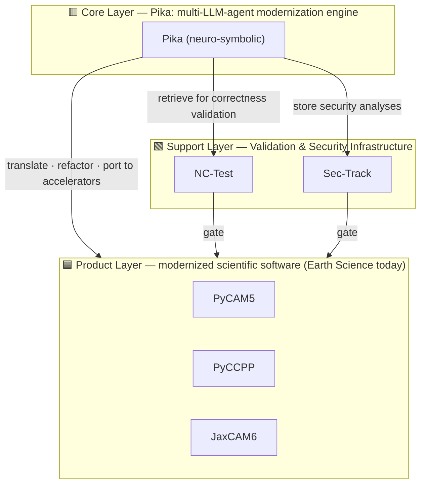

# SciRecast

**An open-source, agentic ecosystem for modernizing legacy scientific software.**

SciRecast makes the modernization of legacy scientific codes *reusable, reproducible,
validable, secure, and scalable* across scientific domains, programming languages, and
computing platforms. LLM agents do the labor-intensive porting work under human oversight;
every artifact ships only after passing correctness validation and security review.

> This repository is the unified entry point to the SciRecast ecosystem. Each component
> below lives in its own repository — this page maps the ecosystem architecture to those
> repositories and tracks their status.

---

## Guiding Principles

1. **Domain-Need-First** — Modernization goals, success criteria, and priorities are set by
   the needs and practices of the scientific domains SciRecast serves.
2. **Agentic-Design-Focused** — SciRecast maximizes the utility of LLM agents while remaining
   inspectable and subject to human oversight.
3. **Validation & Accountability** — Every modernized artifact is backed by reproducible
   validation evidence and transparent provenance.
4. **Security & Sustainability** — Signed releases, CI/CD-backed regression testing,
   responsible vulnerability disclosure, and open governance.

---

## Ecosystem Architecture

SciRecast is organized into three layers. **Humans maintain the inner two layers**
(the agent engine, and the validation & security infrastructure). **The agent produces the
outermost layer** — and only after the artifact passes validation and security checks.

**Contribution model.** Unlike traditional open-source ecosystems, human developers do **not**
directly modify the modernized software in the Product Layer. When end users open issues, the
agentic engine (Pika) generates, tests, and merges the fixes. Humans instead contribute to the
**Core Layer** (extending Pika with new formal methods and agentic designs) and to the
**Support Layer** (adding benchmark suites, completing validation workflows, and responsibly
reporting vulnerabilities).

---

## 🟦 Product Layer — Modernized Scientific Software

End-user-facing modernized software. Current focus: **Earth Science**.

| Product | Repository | Description | Status |
|---|---|---|---|
| **PyCAM5** | [`PyCAM5`](https://github.com/a85tract/PyCAM5) | Python version of the Community Atmosphere Model 5, modularized for flexible reuse. | 675 runtime selectors; PI & MCO 6-month runs **bit-for-bit equal** to the native Fortran baseline. |
| **PyCCPP** | [`PyCCPP`](https://github.com/a85tract/PyCCPP) | Python version of the Common Community Physics Package (CCPP), easing integration of physics packages across NOAA, DOE, NASA, and the U.S. Air Force. | Early stage. |
| **JaxCAM6** | [`CESM-jax-kernels`](https://github.com/a85tract/CESM-jax-kernels) | JAX version of CAM6 with computational kernels accelerated on NVIDIA GPUs (8 physics schemes). | ZM / MG / Kessler / Held-Suarez / TJ2016 validated; CLUBB in progress; Radiation partial. |

**Related delivery components** (supporting the CAM6 port; not yet a self-contained product):

| Repository | Description |
|---|---|
| [`CESM-numba-kernels`](https://github.com/a85tract/CESM-numba-kernels) | Numba `@njit` (CPU) + `@cuda.jit` (GPU) kernels for CAM6 physics — the second acceleration path. |
| [`CESM-pyphys-bridge`](https://github.com/a85tract/CESM-pyphys-bridge) | Fortran ↔ Python runtime bridge: embedded CPython lets Fortran CAM physics call JAX/Numba kernels, selectable by environment variable. |

---

## 🟩 Support Layer — Validation & Security Infrastructure

The trust foundation. Human contributors extend these; the agent consumes them as gates.

| Component | Repository | Description | Status |
|---|---|---|---|
| **NC-Test** | [`hpc-devsecops`](https://github.com/a85tract/hpc-devsecops) | A **CI/CD validation workflow** covering both **security testing** and **correctness testing** of modernized software. Its security half is built today — a reusable local + CI/CD DevSecOps gate (gitleaks secret scan, SBOM+CVE+VEX via syft/grype, Claude AI code audit, `ifx`+AddressSanitizer); correctness testing will be added into the same workflow. | Security testing verified on Derecho (NCAR); correctness testing planned. |
| **Sec-Track** | [`CESM-Sec-Track`](https://github.com/a85tract/CESM-Sec-Track) | Repository of N-day and responsibly disclosed 0-day vulnerabilities spanning the software, its supply-chain dependencies, and the runtime environment. **Access restricted to the PI's group.** | Active. |

---

## 🟥 Core Layer — Pika, the Modernization Engine

**Pika** is a multi-LLM-agent modernization engine that combines the generative power of LLMs
with the rigor of formal methods (neuro-symbolic). It translates languages, refactors
architectures, ports code to accelerators, retrieves NC-Test for correctness validation, and
stores security analyses to Sec-Track.

| Repository | Role | Description |
|---|---|---|
| [`CESM-language-translator`](https://github.com/a85tract/CESM-language-translator) | Tool | Deterministic Fortran → Python translation pipeline (SymPy-based); ZM + MG2 translations verified bit-exact. |
| [`CESM-Agent-Produced-Scripts`](https://github.com/a85tract/CESM-Agent-Produced-Scripts) | Tool | Agent-produced scripts supporting the modernization workflow. |

---

## Domain View

| Domain | Entry point | Description |
|---|---|---|
| Earth Science (CESM/CAM) | [`CESM-modernization-overview`](https://github.com/a85tract/CESM-modernization-overview) | Master tracker / dashboard for the CAM physics Fortran-to-Python (JAX/Numba GPU) porting effort — per-scheme progress, validated-run archive, and deployment reference. |

---

## Licensing & Governance

SciRecast is licensed under the **Apache License 2.0** — see [`LICENSE`](LICENSE) and
[`NOTICE`](NOTICE). All artifacts are released under the same license with public issue
trackers, with two exceptions:

- **Legacy code** retained inside modernized software remains under its original open-source
  license, as documented in the `NOTICE` file of the respective component repository.
- **Sec-Track** access is restricted to the PI's group to reduce the risk of malicious
  exploitation.

---

## Status of This Hub

SciRecast is transitioning from a research prototype to a sustainable ecosystem. Naming in
this hub follows the ecosystem architecture (Pika / NC-Test / Sec-Track / JaxCAM6); the
backing repositories currently retain their `CESM-*` working names, noted in each table.
