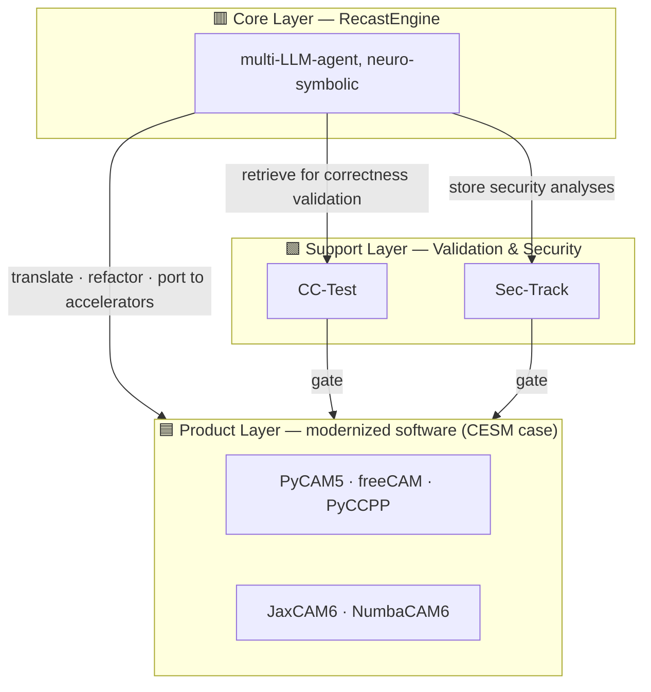

# SciRecast

**An open-source, agentic ecosystem for modernizing legacy scientific software.**

LLM agents do the labor-intensive porting work under human oversight; every artifact ships
only after passing correctness validation and security review. This repository is the entry
point, and it contains exactly two things:

| | What it is |
|---|---|
| [`RecastEngine`](RecastEngine) | The modernization engine — the reusable, domain-independent part of SciRecast. |
| [`CESM-modernization-overview`](CESM-modernization-overview) | Our first case: modernizing CESM/CAM, the community Earth-system model. |

Everything else lives inside the case. Run
`git submodule update --init --recursive` to populate both.

---

## The Three Layers, Seen Through the CESM Case

SciRecast is organized into three layers. **Humans maintain the inner two** (the engine, and
the validation & security infrastructure); **the agent produces the outermost one** — and only
after the artifact passes the gates.

```mermaid
flowchart TB
    subgraph Product["🟦 Product Layer — modernized software (CESM case)"]
        PyCAM5["PyCAM5 · freeCAM · PyCCPP"]
        JaxCAM6["JaxCAM6 · NumbaCAM6"]
    end
    subgraph Support["🟩 Support Layer — Validation &amp; Security"]
        CCTest["CC-Test"]
        SecTrack["Sec-Track"]
    end
    subgraph Core["🟥 Core Layer — RecastEngine"]
        Engine["multi-LLM-agent, neuro-symbolic"]
    end

    Engine -- "translate · refactor · port to accelerators" --> Product
    Engine -- "retrieve for correctness validation" --> CCTest
    Engine -- "store security analyses" --> SecTrack
    CCTest -- "gate" --> Product
    SecTrack -- "gate" --> Product
```

**🟥 Core Layer — [`RecastEngine`](RecastEngine).** A multi-LLM-agent engine that combines the
generative power of LLMs with the rigor of formal methods (neuro-symbolic). It translates
languages, refactors architectures, ports code to accelerators, retrieves CC-Test for
correctness validation, and stores security analyses to Sec-Track. In the CESM case it drives
the deterministic Fortran → Python translation pipeline (SymPy-based); the ZM and MG2 schemes
are verified bit-exact.

**🟩 Support Layer — the trust foundation.** *CC-Test* is a CI/CD workflow covering both
**C**orrectness and **C**yber testing; its Cyber half is a working DevSecOps gate (secret
scanning, SBOM + CVE + VEX, AI code audit, sanitizer builds), verified on NCAR's Derecho.
*Sec-Track* is a restricted-access record of N-day and responsibly disclosed 0-day
vulnerabilities across the software, its supply chain, and its runtime.

**🟦 Product Layer — the modernized software itself.** For CESM this runs as two pipelines:
CAM5 rewritten to modular Python (`PyCAM5`, `freeCAM`, `PyCCPP`), and CAM6 physics kernels
ported to GPUs (`JaxCAM6`, `NumbaCAM6`). Per-scheme progress and validated-run evidence live in
the [case tracker](CESM-modernization-overview).

**Contribution model.** Human developers do **not** directly modify the Product Layer. When end
users open issues, RecastEngine generates, tests, and merges the fixes. Humans contribute to the
Core Layer (new formal methods and agentic designs) and to the Support Layer (benchmark suites,
validation workflows, vulnerability reports).

---

## Contributing & Contact

See [`CONTRIBUTING.md`](CONTRIBUTING.md). Bug reports and feature ideas go to the relevant
component repository. **Security vulnerabilities:** please do *not* open a public issue — use a
private GitHub security advisory or email **Yueqi Chen** (University of Colorado Boulder),
<yueqi.chen@colorado.edu>.

## License

Apache License 2.0 — see [`LICENSE`](LICENSE) and [`NOTICE`](NOTICE). Two exceptions: legacy
code retained inside modernized software keeps its original license (documented in each
component's `NOTICE`), and Sec-Track access is restricted to reduce exploitation risk.
