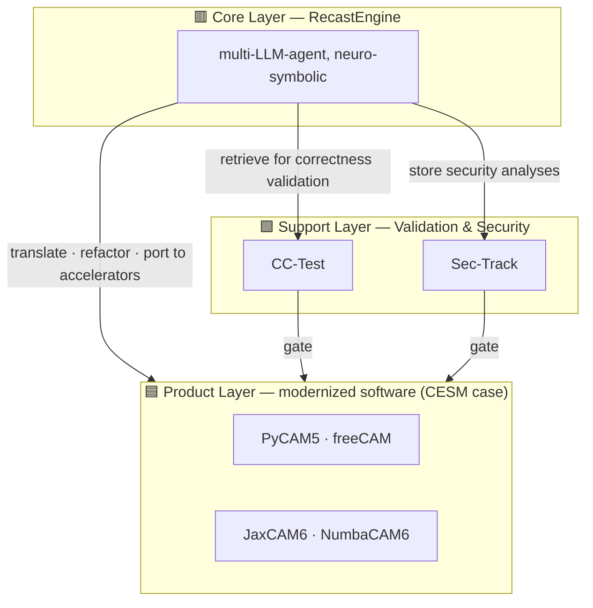

# SciRecast

**An open-source, agentic ecosystem for modernizing legacy scientific software.**

LLM agents do the labor-intensive porting work under human oversight; every
artifact ships only after passing correctness validation and security review.
This page is the architecture — what the three layers are and why the boundaries
fall where they do. The engine and the first case each have their own:

| | |
|---|---|
| **[RecastEngine](engine)** | the engine: the spine, the plugin contract, and what its own gates conclude |
| **[CESM Case](cesm)** | the first case: two pipelines, their component repositories, and the counted inventory |
| **[Contributing](contribute)** | where to send what, and how to extend the engine |

## The three layers, seen through the CESM case

SciRecast is organized into three layers. **Humans maintain the inner two** (the engine, and
the validation & security infrastructure); **the agent produces the outermost one** — and only
after the artifact passes the gates.

**🟥 Core Layer — [`RecastEngine`](https://github.com/a85tract/RecastEngine).** A multi-LLM-agent
engine, neuro-symbolic: it translates languages, refactors architectures, ports code to
accelerators, and gates every result against the original. It knows nothing about any
particular model — domain knowledge attaches through its published plugin contract, which is
what makes a second case possible without rebuilding anything. → **[RecastEngine](engine)**

**🟩 Support Layer — the trust foundation.** [`CC-Test`](https://github.com/a85tract/CESM-CC-Test)
is the CI/CD workflow covering both **C**orrectness and **C**yber testing;
[`Sec-Track`](https://github.com/a85tract/CESM-Sec-Track) is the restricted-access record of
N-day and responsibly disclosed vulnerabilities. A separate layer by design: a gate the gated
thing can influence is not a gate. → **[CESM Case](cesm)**

**🟦 Product Layer — the modernized software itself.** Modernized artifacts are *outputs*, not
components: what comes out when the engine, the domain knowledge, and the legacy source are
put together. Nobody hand-maintains this layer. For CESM that is
[`PyCAM5`](https://github.com/a85tract/PyCAM5),
[`freeCAM`](https://github.com/a85tract/freeCAM),
[`JaxCAM6`](https://github.com/a85tract/CESM-jax-kernels) and
[`NumbaCAM6`](https://github.com/a85tract/CESM-numba-kernels). → **[CESM Case](cesm)**

**Who changes what** follows from the layering: humans maintain the inner two, the agent
produces the outermost, and nobody edits generated output by hand.
→ **[Contributing](contribute)**
