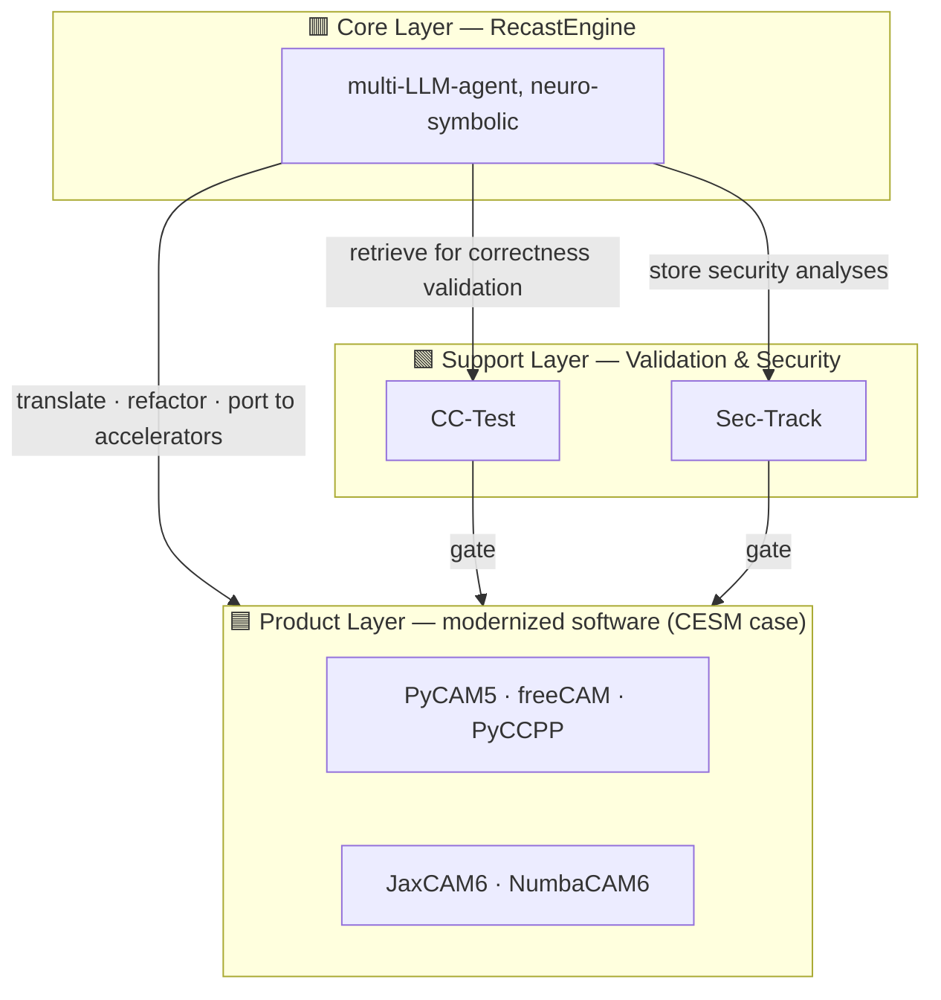

# SciRecast

**An open-source, agentic ecosystem for modernizing legacy scientific software.**

LLM agents do the labor-intensive porting work under human oversight; every
artifact ships only after passing correctness validation and security review.
This page is the architecture — what the three layers are and why the boundaries
fall where they do. The engine and the first case each have their own:

| | |
|---|---|
| **[RecastEngine](engine)** | the engine itself: the spine, the plugin contract, what is registered, and what its own gates conclude |
| **[CESM Case](cesm)** | the first case: component inventory, per-scheme progress, and every gate conclusion recorded so far |
| **[Contributing](contributing)** | who changes what, where to send it, and how to extend the engine |

## The Three Layers, Seen Through the CESM Case

SciRecast is organized into three layers. **Humans maintain the inner two** (the engine, and
the validation & security infrastructure); **the agent produces the outermost one** — and only
after the artifact passes the gates.

**🟥 Core Layer — [`RecastEngine`](https://github.com/a85tract/RecastEngine).** A multi-LLM-agent
engine that combines the generative power of LLMs with the rigor of formal methods
(neuro-symbolic). It translates languages, refactors architectures, ports code to
accelerators, and gates every result against the original. The engine knows nothing about any
particular model: domain knowledge attaches through its published plugin contract, which is
what makes a second case possible without rebuilding anything. Its own
[`docs/architecture.md`](https://github.com/a85tract/RecastEngine/blob/main/docs/architecture.md)
carries the spine, the ten interfaces, and where the boundaries fall.

**🟩 Support Layer — the trust foundation.** *CC-Test* is the CI/CD workflow covering both
**C**orrectness and **C**yber testing; *Sec-Track* is the restricted-access record of N-day and
responsibly disclosed vulnerabilities across the software, its supply chain, and its runtime.
This is a separate layer because a gate the gated thing can influence is not a gate — what
these two check, and how strictly, is deliberately not the engine's decision to make. The CESM
case's instances of both, with their operational detail, are in the case repository.

**🟦 Product Layer — the modernized software itself.** Modernized artifacts are *outputs*, not
components: what comes out when the engine, the domain knowledge, and the legacy source are
put together. Humans do not hand-maintain this layer. For CESM, the products and their
per-scheme status are tracked in the case repository.

**Where the case lives.** Component repositories, pipeline structure, per-scheme progress and
recorded gate conclusions are all on the **[CESM Case](cesm)** page and the three pages under
it — maintained there, and nowhere twice.

**Who changes what** follows from the layering: humans maintain the inner two,
the agent produces the outermost, and nobody edits generated output by hand. The
[Contributing](contributing) page says why, and where to send what.

---

## Why an umbrella repository at all

Because the submodule pointers are a record, not decoration. This repository at a given commit
pins one exact revision of the engine and one of the case, so a result can be reproduced from a
single hash: `git submodule update --init --recursive` and you have the tree that produced it.
The `Advance <component> to <sha>` commits in the history are that record over time, and the
hooks in [`hooks/`](hooks/) (install with [`tools/install-hooks.sh`](tools/install-hooks.sh))
are what keep the pointers from silently falling behind the work.

---
